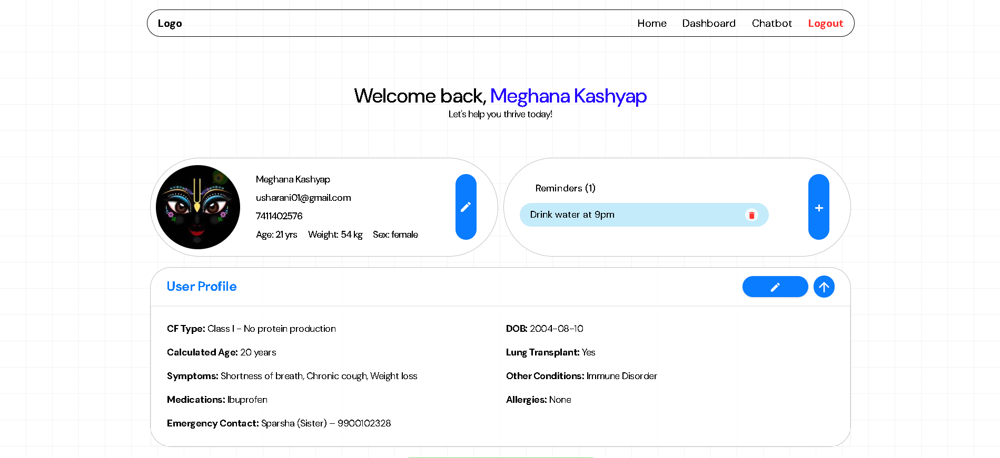
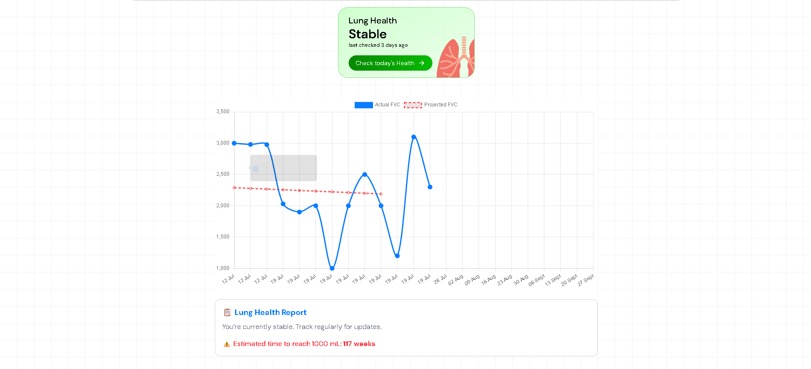

# Cystic Fibrosis Health Care Application

## Overview

This project is a web application designed to assist patients with Cystic Fibrosis in tracking their health metrics, managing their diet, and interacting with a chatbot for health-related queries.

## Tech Stack

### Frontend

- **React.js**: For building the user interface.
- **Framer Motion**: For animations.
- **React Router**: For navigation.
- **Axios**: For API calls.
- **Tailwind CSS**: For styling.

### Backend

- **Flask**: For building the server-side application.
- **Flask-CORS**: For handling cross-origin requests.
- **Python**: Backend programming language.
- **PyTorch**: For machine learning models.

### Database

- **SQLite**: For storing user data and chat history.

### Other Tools

- **dotenv**: For environment variable management.
- **Toastify**: For notifications.

## Features

- **User Authentication**: Login and signup functionality.
- **Dashboard**: Displays user health metrics, diet summary, and enzyme estimates.
- **Chatbot**: Interactive chatbot for health-related queries.
- **File Upload**: Allows users to upload lung X-rays and other files.
- **Responsive Design**: Optimized for both desktop and mobile devices.

## UI Screenshots

<div style="display: grid; grid-template-columns: repeat(2, 1fr); gap: 16px;">
  
  
  
  
</div>

## Installation

1. Clone the repository:

   ```bash
   git clone https://github.com/CysticFibrosis25/CysticFibrosis.git
   ```

2. Navigate to the project directory:

   ```bash
   cd CysticFibrosis
   ```

3. Install dependencies:

   - **Frontend**:

     ```bash
     cd client
     npm install
     ```

   - **Backend**:

     ```bash
     cd server
     pip install -r requirements.txt
     ```

4. Start the application:

   - **Frontend**:

     ```bash
     npm run dev
     ```

   - **Backend**:

     ```bash
     python app.py
     ```

## License

This project is licensed under the MIT License.
